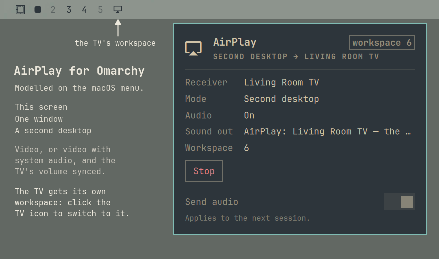

# omarchy-airplay

A native AirPlay 2 **sender** for Linux: mirror a Wayland desktop, a single
window, or an extra virtual display to an AirPlay receiver, with optional system
audio and volume sync.

## AirPlay for Omarchy

On a Mac, AirPlay is a menu in the menu bar: pick a TV, then pick how to use
it. You can mirror the screen, send one window, or use the TV as a separate
display. AirPlay for Omarchy brings that experience to Omarchy, natively. It
isn't a wrapper around someone else's tool. The sender was written and tested
from the ground up in Rust for Wayland and Hyprland, and performance and
security were the design constraints from the start.



- **Three ways to use a TV, as on a Mac:** this screen, one window, or a second
  desktop.
- **Video, or video with sound.** With **Send audio** on, the laptop's sound
  moves to the TV through its own *AirPlay: <TV>* output, the way a Mac hands
  over its sound. The TV's volume follows the laptop's, and your speakers come
  back when the session ends.
- **The second desktop is one click away.** The TV gets its own workspace, and
  the workspace bar shows it as a TV icon at the end of the row: click it to
  switch there, and drag a window onto it to put that window on the TV.
- **Fast.** Screen capture stays on the GPU and goes straight into the
  hardware H.264 encoder (zero-copy). It takes about 5 ms from a frame being
  drawn to being encoded, using about 7 % of one CPU core. See
  [Performance](#performance).
- **Careful.** Pairing keys stay private to your account. Every build is pinned
  to a tested commit. The bar menu only ever stops, cleans up or signals
  something it started and recorded.

It is three pieces, and the full experience needs all three:

| Piece | Its part in the set |
|-------|---------------------|
| [omarchy-airplay](https://github.com/jonspinks/omarchy-airplay) | **The sender.** Finds receivers, pairs, captures the screen, a window or a virtual display, encodes on the GPU and streams video and sound. |
| [omarchy-cast](https://github.com/jonspinks/omarchy-cast) (`blacksheep.airplay`) | **The AirPlay menu.** The bar icon and panel: receivers, the three modes, pairing, Send audio and Stop. |
| [omarchy-workspaces](https://github.com/jonspinks/omarchy-workspaces) (`blacksheep.workspaces`, listed as *Cast Workspaces*) | **The TV in your workspace bar.** Marks the second desktop's workspace with a TV icon at the end of the row, so it is one click to reach. |

Omarchy plugins can't declare dependencies, so each piece is installed on its
own. [omarchy-cast's README](https://github.com/jonspinks/omarchy-cast#install)
has the steps in order.

### This repo: the sender

The engine behind the set, and a normal CLI that works on its own (`airplay
discover`, `airplay pair`, `airplay mirror`). Written in Rust, and ported from a
Python probe that reverse-engineered the protocol against a real receiver
([omarchy-airplay-probe](https://github.com/jonspinks/omarchy-airplay-probe)).
It talks to Hyprland for window and virtual-display capture, to VA-API for
H.264, and to PipeWire for sound. Nothing is shelled out to a screen recorder
or a media framework.

## Status

Reverse-engineered from observed behaviour, not from any Apple specification.
Treat the support matrix as "what has actually been made to work", not as a
statement about AirPlay in general.

| Receiver | State |
|---|---|
| Samsung Frame (`LS*`) | **works** — proven end to end, video + audio + volume sync |
| Other Samsung / generic AirPlay 2 displays | expected to work, untested |
| Mac (as receiver) | connects, untested beyond that |
| Apple TV | **not supported** — requires FairPlay, which this does not implement |
| Speakers (HomePod, Sonos, AV amps) | **not supported** — audio is sent alongside video to a display, not standalone |

## Requirements

- **Rust** 1.75+ to build
- **ffmpeg** with VA-API — H.264 is encoded on the GPU via `/dev/dri/renderD128`,
  falling back to `libx264` on CPU with `--encoder cpu`
- **avahi** (`avahi-browse`), running, for discovery
- **PipeWire** (`pw-dump`, `pw-metadata`) and **libpulse** (`pactl`) for audio
  capture and output switching
- **Hyprland** (`hyprctl`) for window and virtual-display modes
- A kernel/driver combination with working Wayland screencopy

On Arch / Omarchy:

```bash
omarchy pkg add rust ffmpeg avahi pipewire libpulse
sudo systemctl enable --now avahi-daemon
```

## Build

```bash
git clone https://github.com/jonspinks/omarchy-airplay
cd omarchy-airplay
cargo build --release
install -Dm755 target/release/airplay ~/.local/bin/airplay
```

## Use

```bash
airplay discover                      # what is on the network
airplay mirror <ip> --output DP-1     # mirror a specific output
airplay mirror <ip> --extend          # a second desktop that exists only on the TV
airplay mirror <ip> --window "Firefox"
airplay mirror <ip> --extend --audio system   # send system sound too
airplay extend --cleanup              # remove a virtual display a crash left behind
airplay audio  --cleanup              # put back an output a killed session left set
```

`--seconds 0` runs until stopped (SIGINT/SIGTERM, the receiver going away, or a
fatal error) and prints the same ledger as a run whose clock expired. `airplay
--help` documents the full surface, including the benchmark subcommands used
during development (`mirror-bench`, `capture-bench`, `encode-bench`).

### Pairing

Most receivers connect without a code. One set to ask shows four digits on its
own screen:

```bash
airplay pair <ip> --interactive     # ask, wait for the code, answer on one socket
airplay pair --list
airplay pair <ip> --forget
```

The code belongs to the *connection* that asked for it. Submitting it from a
second command makes the receiver issue a new number and reject the one you just
read, so the exchange has to be held open across the wait — which is why
`--interactive` exists and why a two-command flow cannot work.

A receiver that has just ended a session refuses the next pair-setup for a moment
while it tears the old one down; connection-level failures are retried up to
three times, so expect the first attempt after a session to take around twenty
seconds.

## Performance

Measured with the sender's own benchmarks on a ThinkPad X1 Carbon Gen 13
(Intel Core Ultra 7 255U, integrated graphics, VA-API H.264), Omarchy on
Hyprland 0.56, capturing the laptop's 1920x1200 panel for a 1920x1080 receiver.
`mirror-bench` runs the real pipeline a session uses, capture and hardware
encode, and stops short of the network.

| | |
|---|---|
| Capture to encoded frame | **5.4 ms median**, 10.2 ms p95 |
| CPU while streaming | **6.6 % of one core** |
| Copies out of GPU memory | **none**: zero-copy dmabuf capture, 0 fallbacks |
| Frames dropped | 1 of 445, and the ledger balances (published = dropped + encoded) |
| Encoder headroom | about 110 fps of capacity at 1080p (`encode-bench`) |
| Pipeline open | 96 ms |
| Memory | 95 MB while streaming, and flat across a run |

Capture follows the screen's damage, so an idle desktop produces few frames.
That's by design: nothing changed, so nothing is sent. The TV adds its own
buffering on top: about half a second on a Samsung Frame. That delay is the
receiver's, not the sender's.

Reproduce on your machine:

```bash
airplay mirror-bench --output eDP-1 --receiver 1920x1080 --seconds 10 --fps 60 --encoder gpu
airplay encode-bench --encoder gpu --source 1920x1200 --receiver 1920x1080 --frames 600 --fps 60
airplay capture-bench output:eDP-1 --seconds 8
```

## How it works

1. **Discover** via `avahi-browse` on `_airplay._tcp`, taking the address from
   the A/AAAA record rather than the SRV hostname.
2. **Pair** with SRP (pair-setup) and Ed25519/X25519 (pair-verify), deriving
   ChaCha20-Poly1305 keys for the encrypted RTSP channel. Long-term keys are
   stored per receiver.
3. **Capture** the Wayland surface, preferring zero-copy DMA-BUF.
4. **Encode** H.264 through VA-API, CPU fallback available.
5. **Stream** over the AirPlay video channel with NTP-style timing, plus an
   optional ALAC audio stream and a volume channel that maps the local level to
   the receiver's dB scale.

Security note: pair-setup keys are long-term credentials for the receiver. They
live outside the repo and are never logged — no secret reaches stdout, stderr or
the `--json` output.

## Tests

```bash
cargo test
```

The suite is mostly golden vectors under `tests/vectors/`, captured from a real
session and replayed offline, so it runs with no network and no receiver
present. **Every device identifier in those fixtures is synthetic** — the
addresses are the RFC 5737 documentation ranges, the MACs are locally
administered, and the serial number and display UUID are placeholders.
`tests/vectors/gen_audio_vectors.py` regenerates the audio vectors by running
the original probe code; point `AIRPLAY_PROBE` at a checkout of the probe repo.

## Security

- **Pairing keys are long-term credentials** for each receiver. They are kept in
  `~/.config/airplay-rs/credentials` (`$XDG_CONFIG_HOME` if set; directory
  0700, files 0600) and never logged. `airplay pair <ip> --forget` deletes a
  receiver's key; unpair on the TV as well to revoke it there.
- **What is captured:** the chosen output, window or virtual display, and with
  `--audio system` the laptop's system sound. It goes only to the receiver you
  named.
- Discovery trusts mDNS on the local network, like every AirPlay sender.

Please report a security problem privately, from the repository's
**Security** tab, rather than in a public issue.

## License

Licensed under either of [MIT](LICENSE-MIT) or [Apache-2.0](LICENSE-APACHE), at
your option.
